# Schaumkopfschleuder 

Ursprünglich ein Projekt für die MAKER FAIR ROMA 2017.

Das neue Design für die **MAKE FAIR BERLIN 2018** ist da. Der Berliner Bär. Bereits in der neuesten Version V6:

Die **Version V6** ist da. Besser durch:

1. Sperrmuttern an allen beweglichen Teilen
2. Verbesserte Standfestigkeit durch 3 mm extra Breite
3. Verschraubung der senkrechten Querstrebe
4. Schraubenschlüsseldesign mit optimierter Hebelwirkung
5. Das neue Dackel_Design steht bereits in der Version V6 zur Verfügung 

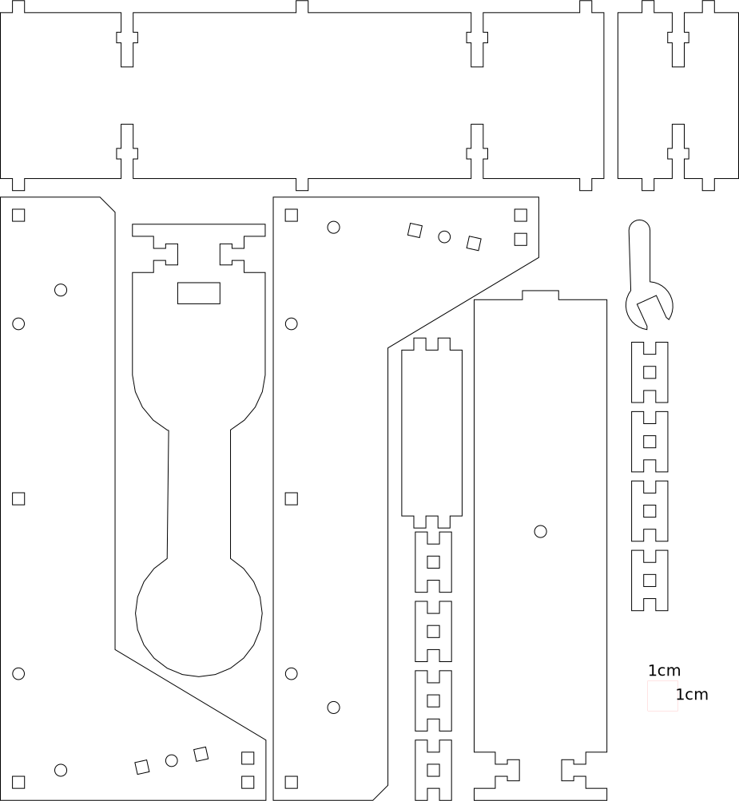

Die **aktuelle Version V5.0 extra stabil**, zum 13.12.2017 veröffentlicht, hat jetzt doppelte H-Stege an den Drehachsen und ist um 2 mm breiter. Die SVG ist dreifarbig. Rot ist gravieren, schwarzen cutten, grün ist auch zum cutten. Wenn Sperrholz im Format 29 x 42 cm verwendet wird passen ohne dem grünen Bauteil zwei Schleudern auf eine Platte. Dragonfire ist noch auf der Version V4.0 aufgebaut.

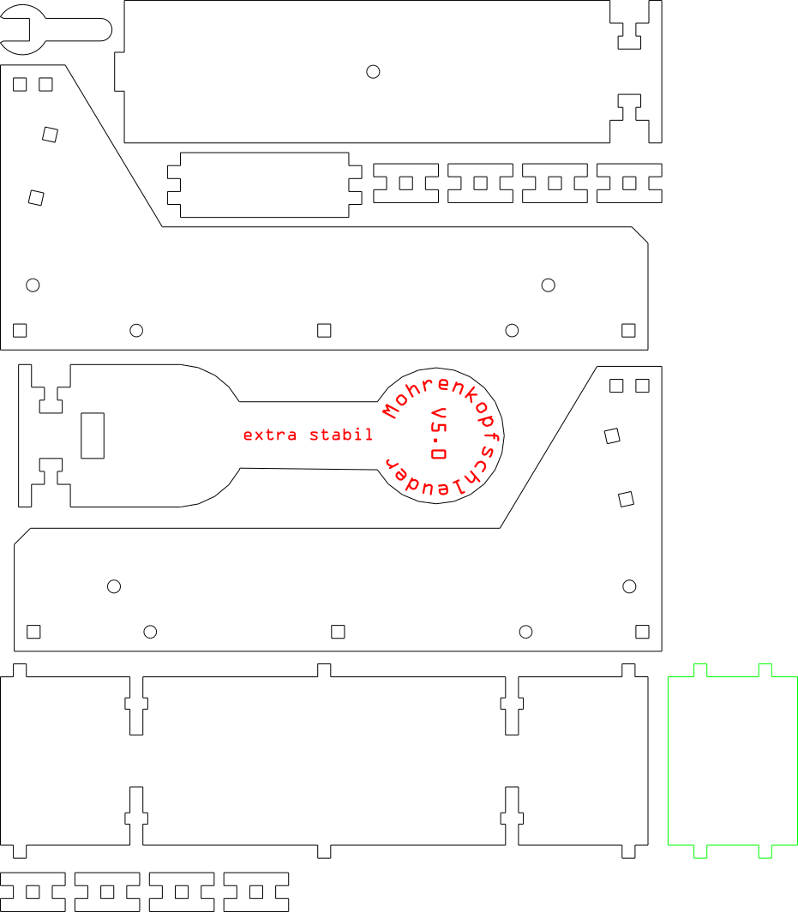 

Für Plattenmaterial 29 x 42 cm sollte man die Version ... alt_Anordnung und  ... Teil  verwenden. Dann passen 2 Schleudern auf eine Platte und bei den beiden beweglichen Teilen läuft die **Maserrichtung der Sperrholzplatte** in Längsrichtung Das grüne "Teil" nicht lasern.

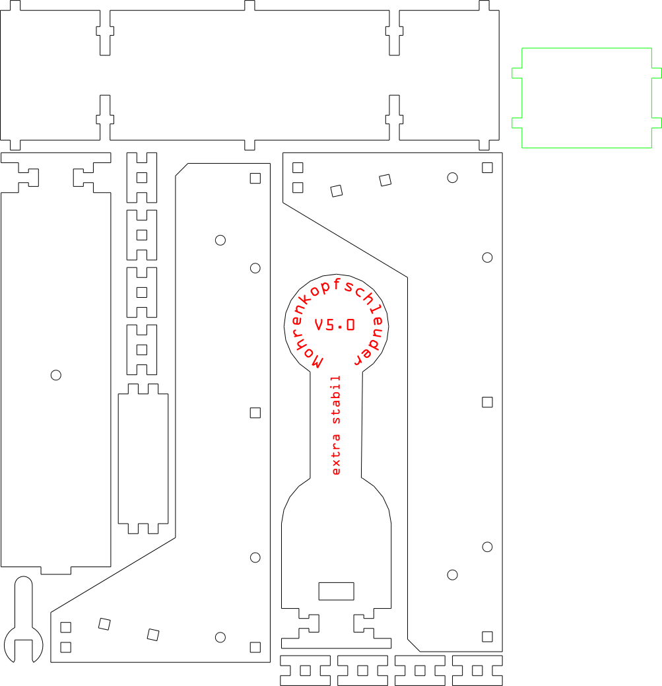 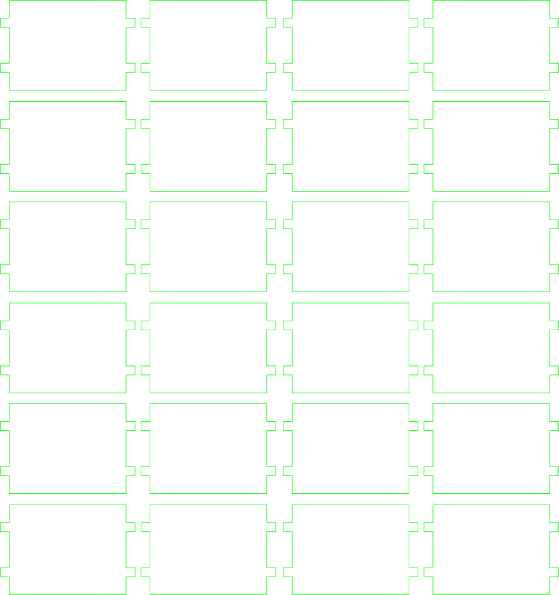

Ein Technikklassikerin wie sie schon die alten Griechen verwendet haben. Man schießt mit der NERF-GUN auf die Zielscheibe und die geballte Kraft des gespannten Gummibandes schleudert einen Mini-Schaumkuss (Mohrenkopf) direkt in Richtung des Schützen. Dieser sollten das Flugobjekt mit dem Mund auffangen.

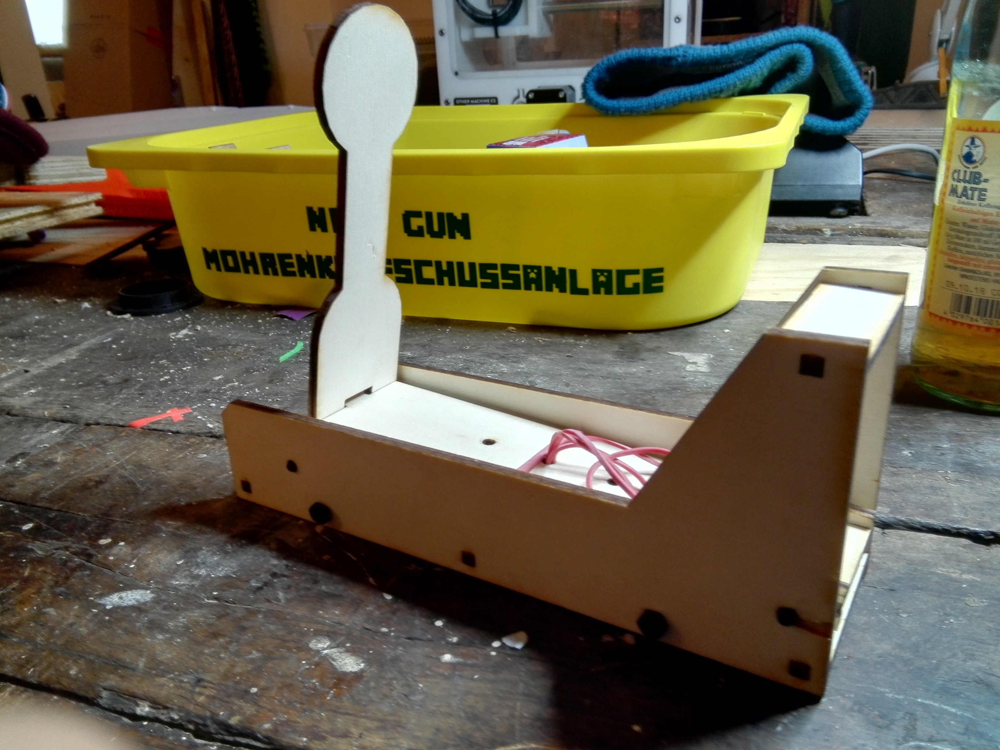 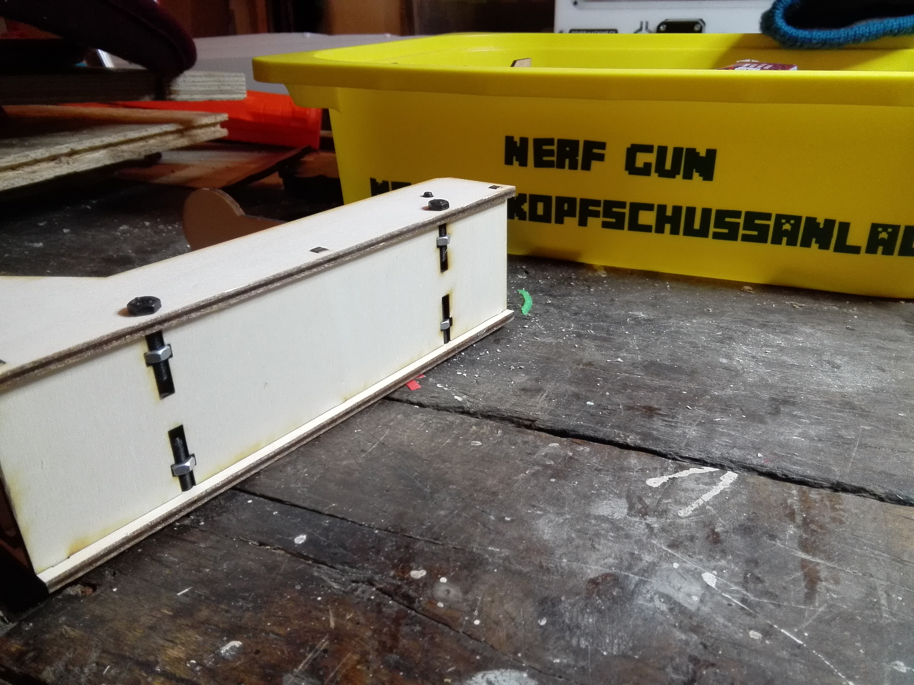 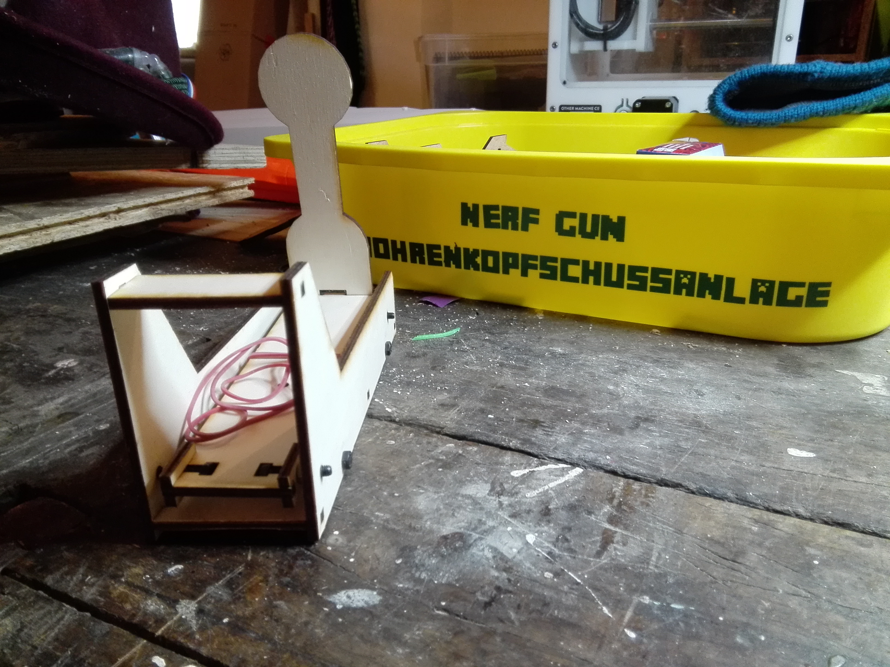

## Design ##

Gezeichnet mit Google SketchUp. Exportiert als 2D Modell im Format DXF.

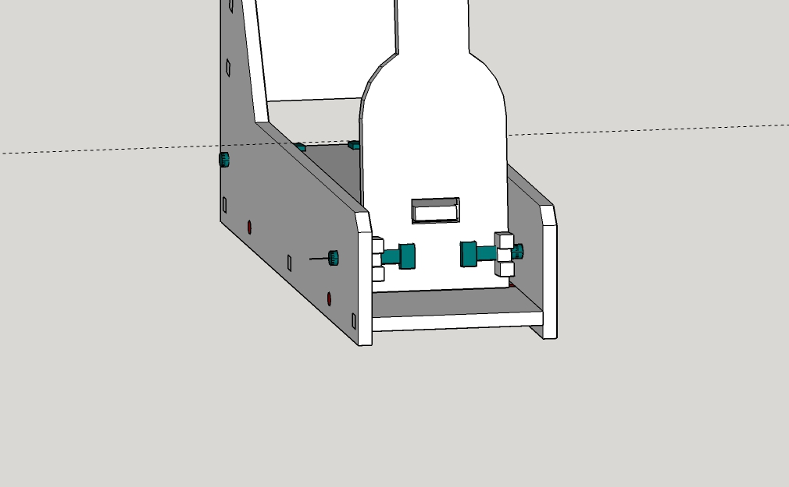 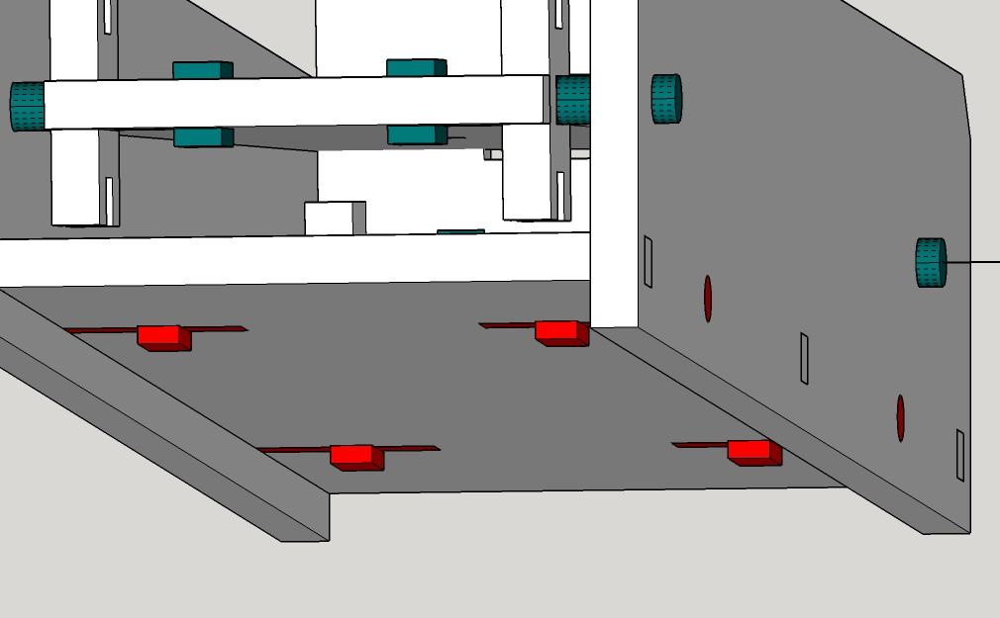 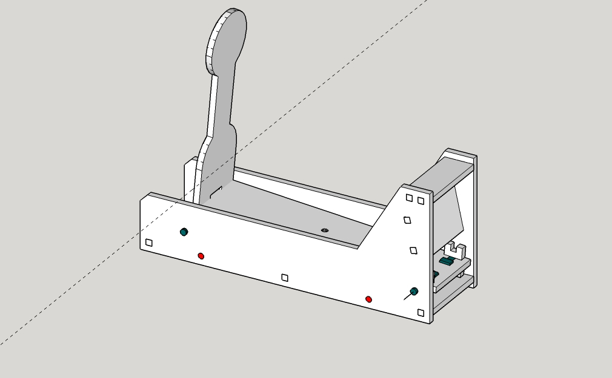

Weiterbearbeitet in Inkscape. Hier wurden noch die Gravuren auf einem extra Layer und in einer anderen Farbe angelegt. Schriften mussten dann noch in Pfade umgewandelt werden.

Beim Import der DXF Datei aus Sketchup entstehen keine durchgehende Pfade der einzelnen Objekte. Dadurch fährt der Laser die einzelnen Pfade der Objekte Stück für Stück ab. Er schneidet nicht durchgehend. Um das zu vermeiden müssen alle Pfade eines Bauteils ausgewählt werden. Danach die Pfade kombinieren. Dann alle Pfade mit dem Knotenwerkzeug + Strg-Taste auswählen. "Gewählte Knoten vereinigen" drücken. Jetzt ist jedes Bauteil ein durchgehender Pfad.

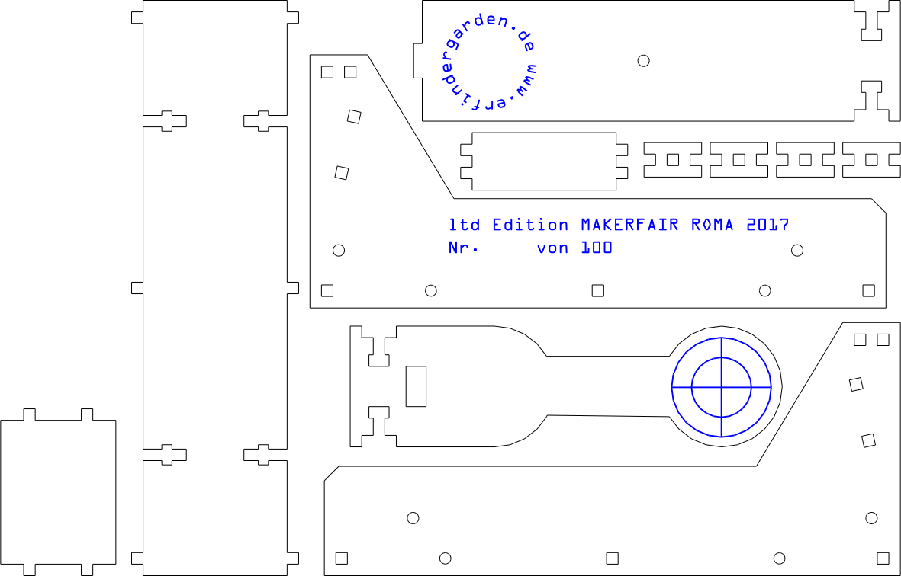

## Produktion ##

Aus einem 4 mm Pappelsperrholz wurde die Schleuder dann im [erfindergarden](http://www.erfindergarden.de) gelastert. Mit 4 Sechskantschrauben M4 x 20 und einem Gummizug wird dann alles fertig montiert.

## Variationen ##

Hier noch ein neues Design: **Dragonfire**
 
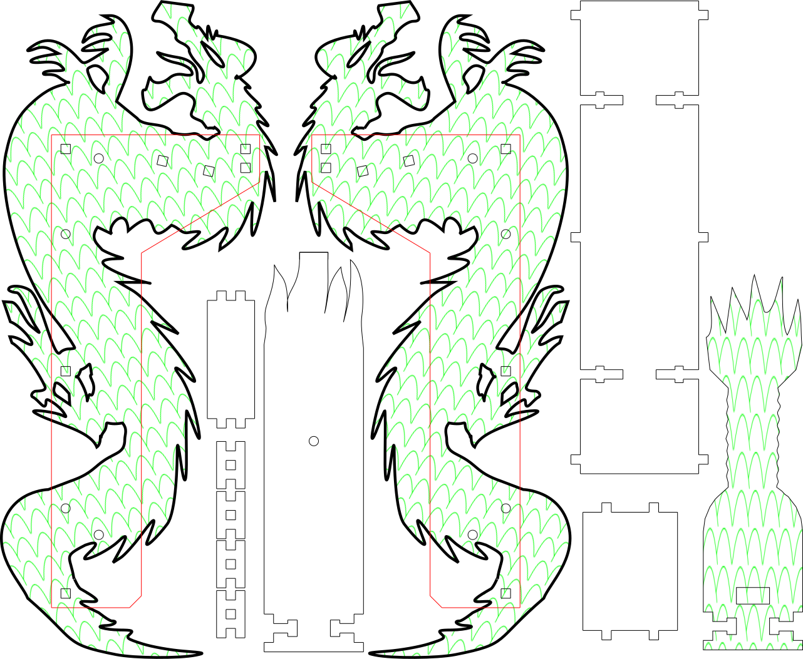
Seitenteile, Wurfarm und Zielscheibe wurden drachenmäßig angepasst. Die Bodenplatte, H-Elemente und Querstreben bleiben gleich. Achtung! Die rote Seitenvorlage nicht mitfräsen, nur die Löcher übernehmen.

Für die Zukunft könnte ich mir noch einige Designs vorstellen:
**Minekraft, Alibaba, Starwars, Ritterburg, Oktoberfest** usw. .....

Zur Makerfair Wien 2018: der **Dackel**

